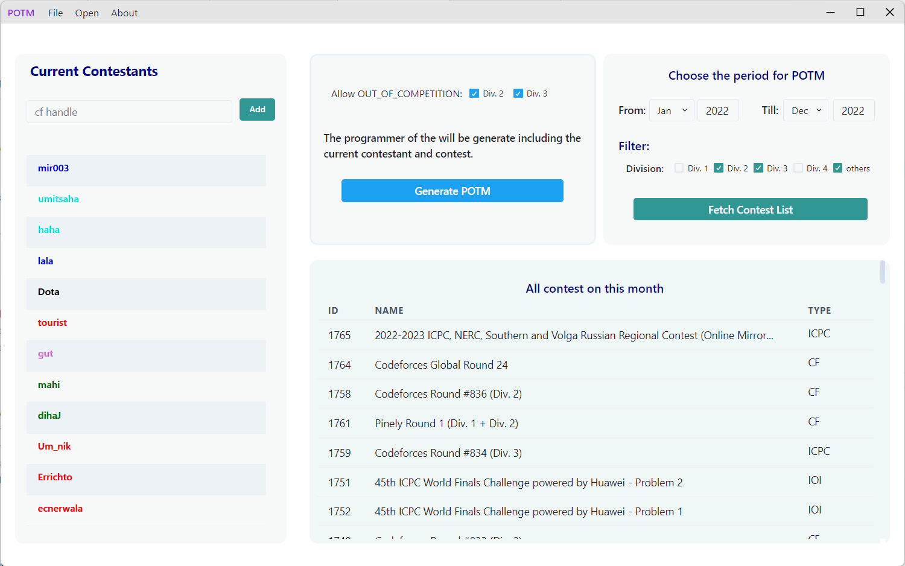

# POTM - Programmer Of The Month
 A desktop application for generating standing for codeforces contestant on a selected contest basis.

## Steps to generate:
  - Add codeforces handles of the participants
  - select time period and some filters to fetch contest 
  - Any particular contest can be removed from the contest list if necessary
  - Now Generate the POTM standing by clicking Generate POTM
  - The Standings can be exported as a pdf file
   
&nbsp;
> The scoring for the standings is according to this  [Scoring Criteria.pdf](https://github.com/jahidem/potm/blob/master/docs/ScoringCriteria.pdf)

 
&nbsp;

&nbsp;

&nbsp;

## Working Preview:

https://user-images.githubusercontent.com/54525656/209444595-d04f82f1-7ca7-488c-8323-c6810d6b5980.mp4

## Tech Statck:
 - Frontend `React`
 - UI library `Chakra UI`
 - State management `React Redux toolkit`
 - TypeScript ORM  `Prisma js`
 - Permanent persistance `Sqlite DB`
 - Application framework `Electron`
 

